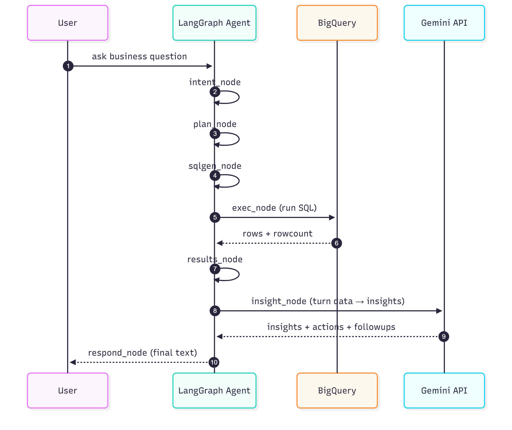

# Architecture Overview

The LangGraph E-commerce Agent converts a natural-language business query into structured BigQuery analysis and human-readable insights.

## Components

**User Layer**
- Sends free-form business queries through the CLI.
- Receives insights, actions, and follow-ups in plain text.

**LangGraph Agent**
- **intent_node** – Classifies the question (product / geo / segment / trend).
- **plan_node** – Chooses the right SQL template and parameters.
- **sqlgen_node** – Builds safe parameterized SQL.
- **exec_node** – Executes queries on BigQuery.
- **results_node** – Computes light aggregates (shares, totals).
- **insight_node** – Calls Gemini to translate numbers into insights.
- **respond_node** – Formats a concise textual response.

**External Integrations**
- **BigQuery** – Public dataset `bigquery-public-data.thelook_ecommerce`.
- **Gemini API** – Used for intent classification, planning, and insight generation.

## Data Flow Summary

1. User enters a question in CLI.  
2. LangGraph processes it through the 7 nodes.  
3. BigQuery returns structured results.  
4. Gemini adds analytical interpretation.  
5. CLI outputs insights + recommendations.

## Request Sequence (detailed)

The following sequence diagram shows how a single CLI question is processed end-to-end.

  
   
  <em>Request Sequence (scaled view)</em>

## Notes
- The agent uses deterministic graph flow (no arbitrary agent jumps).  
- SQL templates and model names are configurable in `config.py`.  
- This diagram aligns with the flow shown in the README's Mermaid snippet.
