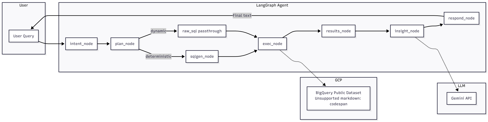
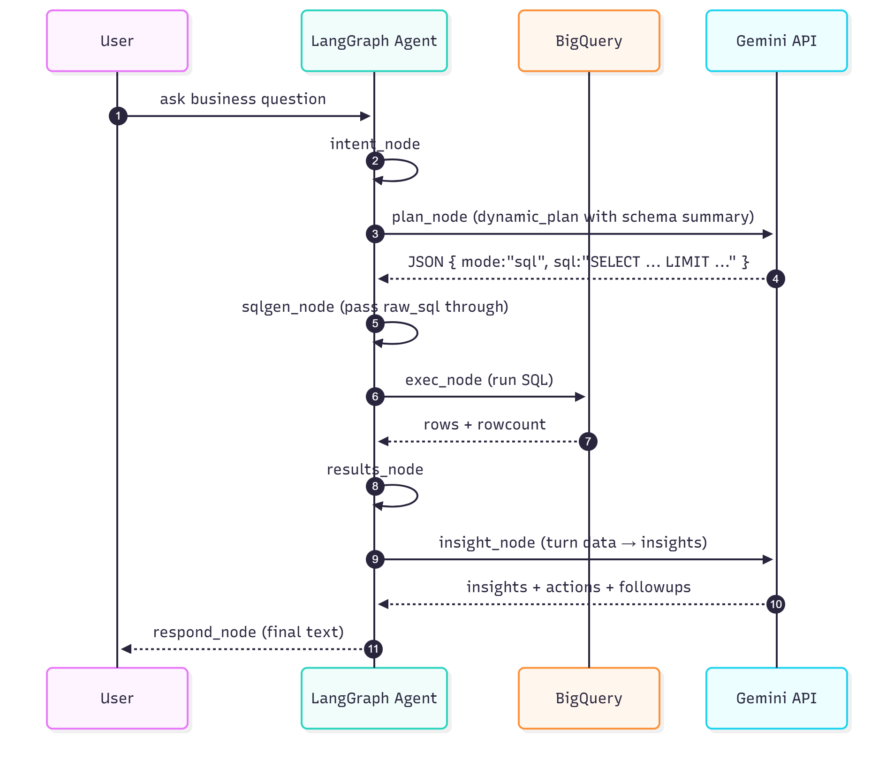

# Architecture Overview

The LangGraph E-commerce Agent converts a natural-language business query into structured BigQuery analysis and human-readable insights.

## Components

**User Layer**
- Sends free-form business queries through the CLI.
- Receives insights, actions, and follow-ups in plain text.

**LangGraph Agent**
- **intent_node** – Classifies the question (product / geo / segment / trend).
- **plan_node** – Chooses **how** to build the query:
  - in deterministic mode it selects a known SQL template and parameters;
  - in dynamic mode it asks Gemini for a JSON plan and produces guarded `raw_sql` (with fallback to trend).
- **sqlgen_node** – For deterministic plans, builds safe parameterized SQL from the chosen template. For dynamic plans, passes through the validated raw SQL.
- **exec_node** – Executes queries on BigQuery.
- **results_node** – Computes light aggregates (shares, totals).
- **insight_node** – Calls Gemini to translate numbers into insights.
- **respond_node** – Formats a concise textual response.

**External Integrations**
- **BigQuery** – Public dataset `bigquery-public-data.thelook_ecommerce`.
- **Gemini API** – Used for intent classification, dynamic planning, and insight generation.

## Data Flow Summary

1. User enters a question in CLI.  
2. LangGraph processes it through the 7 nodes.  
3. At the planning step, the agent runs **either** deterministic planning (template) **or** dynamic planning (LLM JSON → raw SQL with guardrails).  
4. BigQuery returns structured results.  
5. Gemini adds analytical interpretation.  
6. CLI outputs insights + recommendations.

## Request Sequence (detailed)

The following sequence diagram shows the **deterministic** path end-to-end.

  
   
  <em>Deterministic planning – template-based</em>

For the **dynamic** path, planning first calls Gemini to get a SQL plan and only then continues with the same downstream nodes.

  
   
  <em>Dynamic planning – Gemini JSON → guarded raw SQL</em>

## Notes
- The agent still uses a fixed, deterministic **graph** (no arbitrary agent jumps); only the **planning logic** switches between deterministic and dynamic.
- SQL templates, allowed tables, and model names are configurable in `config.py`.
- The diagrams above align with the flow shown in the README’s Mermaid snippet.
